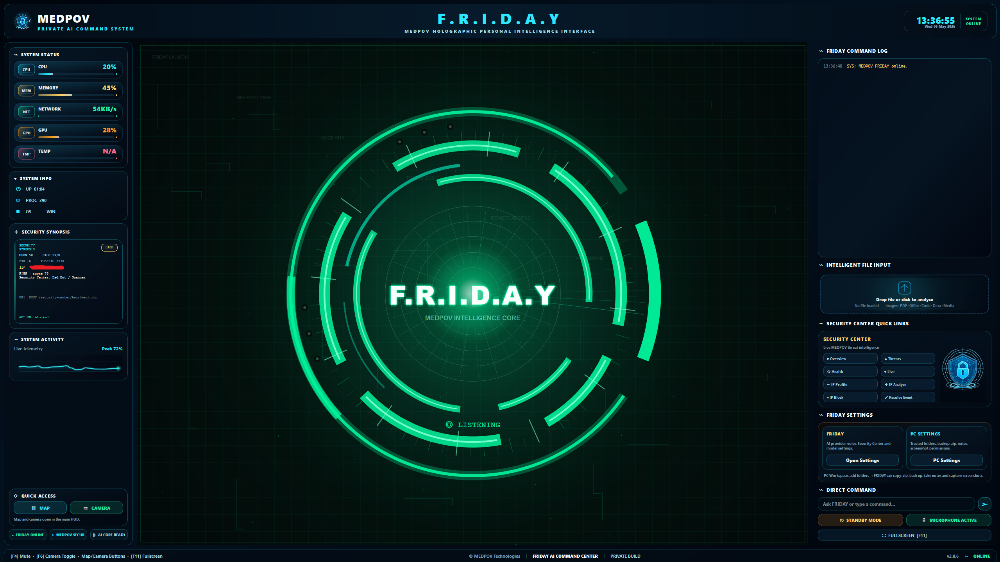
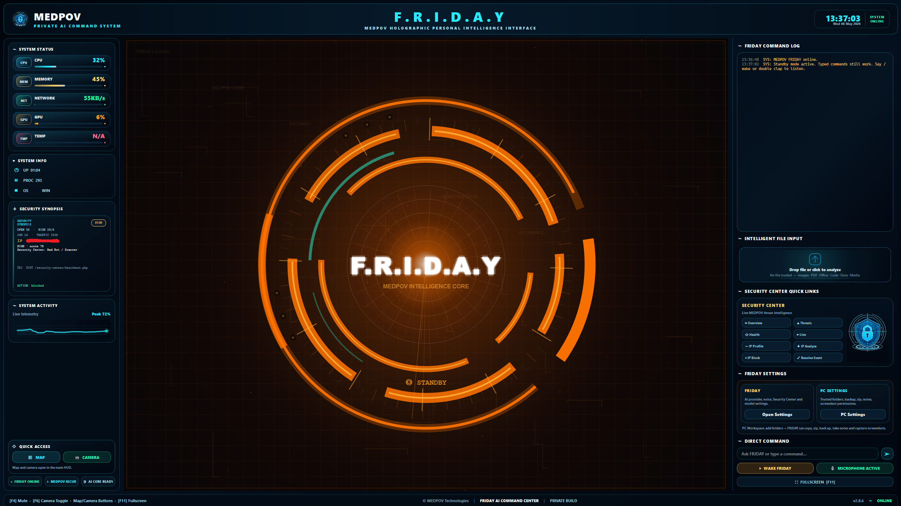
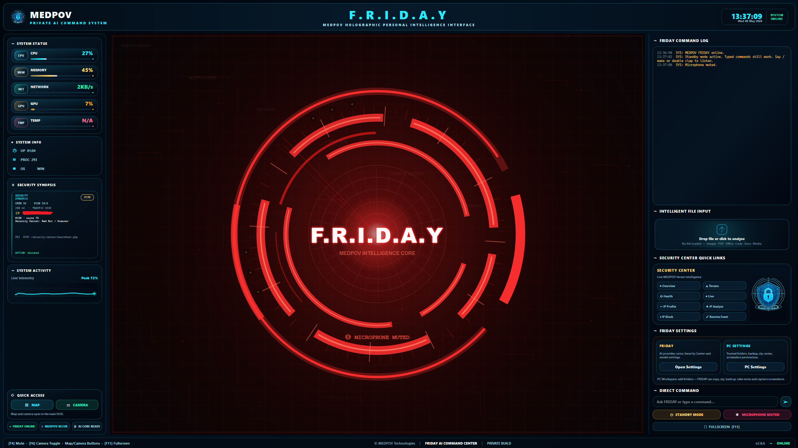
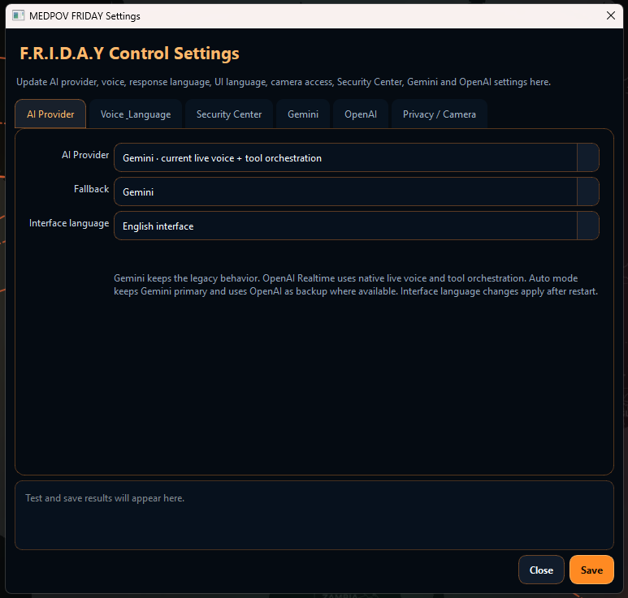
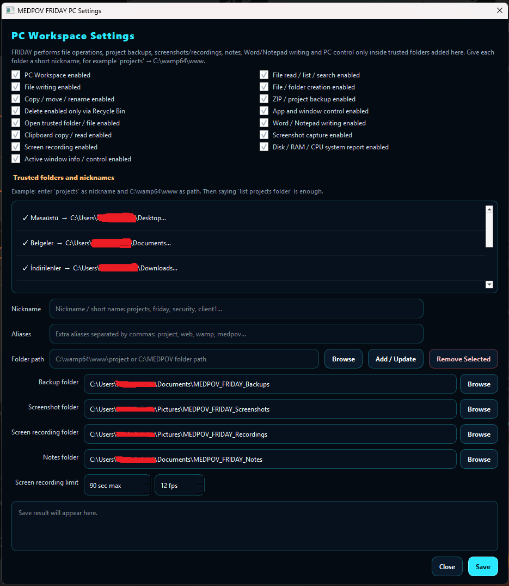
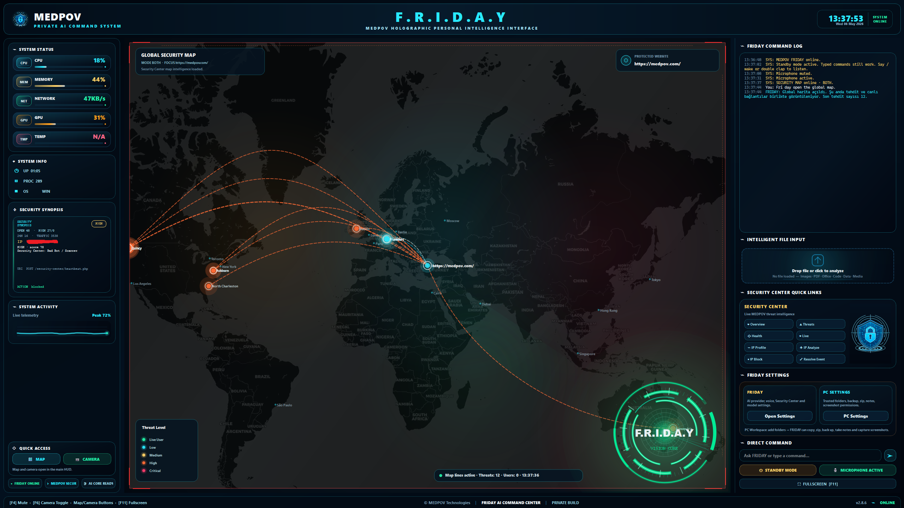
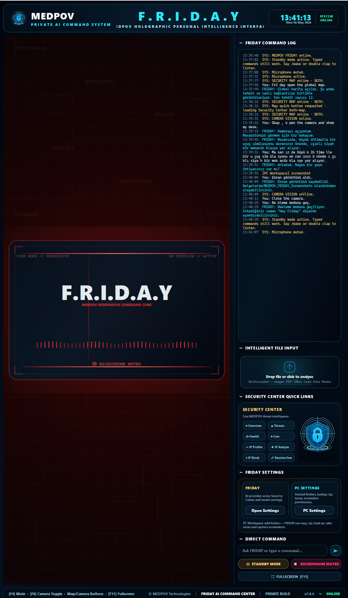
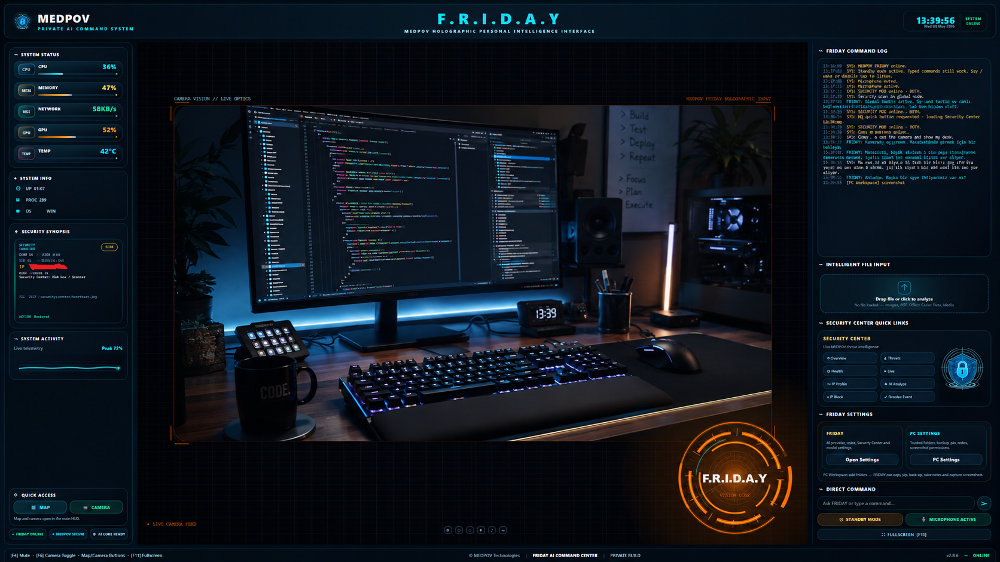

# F.R.I.D.A.Y Command Center

**F.R.I.D.A.Y Command Center v2.8.7** is a local Windows desktop AI command center by **MEDPOV**. It combines a holographic command-center interface, voice and text interaction, camera-assisted desktop analysis, live Security Center map views, local PC controls, file analysis, and independent AI provider support for **Gemini** and **OpenAI**.

Designed by **MEDPOV**.

> F.R.I.D.A.Y runs on the user’s own Windows computer. WAMP is **not required**. The recommended installation path is `C:\MEDPOV\security-center-f.r.i.d.a.y-ai`.

F.R.I.D.A.Y can run as a standalone local desktop assistant or work in parallel with **MEDPOV Security Center**. When connected to a Security Center installation, it can help review security events, monitor threat summaries, display a live security map, analyze suspicious IP addresses, and support operational decisions from the local desktop interface.

MEDPOV Security Center product page:  
https://medpov.com/product/medpov-security-center

---

## Version 2.8.7 Highlights

| Area | What Changed |
|---|---|
| Command Center UI | The desktop command center was strengthened with a more responsive dashboard-style layout. |
| Security Map | A dedicated Security Map view was added and now opens as a clean world map first; threat and live/global activity layers are shown only after explicit commands. |
| Camera Mode | Camera-assisted analysis is available from the command center when enabled. |
| Camera Disable Mode | The camera can be disabled from settings. When disabled, F.R.I.D.A.Y will not open the camera and will respond that camera access is currently disabled. |
| Gemini Provider | Gemini can be configured and used as its own independent AI provider. |
| OpenAI Provider | OpenAI can be configured and used separately from Gemini, including its own model and voice settings. |
| Provider Separation | Gemini and OpenAI settings are no longer treated as one combined setup. Each provider has its own configuration area. |
| TR / EN Language Support | The interface supports Turkish and English language usage. |
| Voice Settings | Voice can be changed from settings. Voice configuration is available for both Gemini and OpenAI modes where supported. |
| PC Settings | A PC Settings area was added for local desktop behavior, camera options, system preferences, and assistant behavior controls. |
| FRIDAY Modes | F.R.I.D.A.Y includes three main operating modes: Listening, Standby, and Mute. |
| Security Center Controls | Security Center access, map view, and integration options are easier to reach from the command center. |

---

## Interface Preview

F.R.I.D.A.Y Command Center includes visual modes, Security Center integration panels, live map views, API configuration screens, responsive layouts, PC settings, and camera-assisted desktop interaction.

<p align="center">
  
</p>

### FRIDAY Modes

<p align="center">
  
  
  
</p>

F.R.I.D.A.Y has three primary modes:

| Mode | Description |
|---|---|
| Listening | F.R.I.D.A.Y actively listens and responds to voice or text commands. |
| Standby | F.R.I.D.A.Y stays available with reduced interaction until activated again. |
| Mute | F.R.I.D.A.Y stops voice output and keeps the interface controlled silently. |

### Security Center and Security Map

<p align="center">
  
  
</p>

### Settings, Responsive UI, Camera and PC Controls

<p align="center">
  
  
  
</p>

---

## What This Application Does

| Area | Description |
|---|---|
| Desktop AI Interface | Provides a local Windows command-center UI for F.R.I.D.A.Y. |
| Gemini AI Provider | Runs Gemini-based voice, text, and assistant behavior when configured. |
| OpenAI AI Provider | Runs OpenAI-based text, vision, camera, file, and assistant behavior when configured. |
| Provider Selection | Allows Gemini, OpenAI, or fallback-style usage depending on the configured settings. |
| Voice Interaction | Supports voice-based interaction with configurable voices where supported by the selected provider. |
| Text Commands | Supports written commands from the command input area. |
| Camera Mode | Uses the local camera for supported vision and desktop assistance workflows when enabled. |
| Camera Disable Mode | Allows camera access to be disabled from settings. |
| Security Map | Shows Security Center map-style monitoring and dashboard visuals when Security Center is connected. |
| File Analysis | Allows supported images, documents, data files, and code files to be analyzed from the UI. |
| Local Actions | Can run supported local desktop, browser, file, folder, and system helper actions. |
| PC Settings | Provides a dedicated settings area for local computer behavior and assistant preferences. |
| Language Support | Supports Turkish and English interface usage. |
| Security Center Integration | Can connect to a remote MEDPOV Security Center installation such as `https://siteadi.com/security-center`. |
| Desktop Shortcut | Creates a `FRIDAY AI` desktop shortcut for easy launching. |

---

## Required Software

Install these before running F.R.I.D.A.Y.

| Requirement | Required | Notes |
|---|---:|---|
| Windows 10 / Windows 11 | Yes | Recommended operating system. |
| Python 3.11+ | Yes | During installation, enable **Add Python to PATH**. Python 3.12 is supported. |
| Git for Windows | Yes | Required to clone the repository. |
| Internet Connection | Yes | Required for AI providers, setup downloads, and optional web actions. |
| Microphone Access | Optional | Required only for voice interaction. |
| Camera Access | Optional | Required only for camera mode. Camera can be disabled from settings. |
| Gemini API Key | Optional | Required only if Gemini provider will be used. |
| OpenAI API Key | Optional | Required only if OpenAI provider will be used. |
| Security Center URL/API Key | Optional | Required only for MEDPOV Security Center integration. |
| Visual C++ Build Tools | Optional | Only needed if a Python package fails to install from a prebuilt wheel on a specific PC. |

At least one AI provider should be configured for full assistant functionality.

---

## Recommended Folder Structure

F.R.I.D.A.Y does **not** need to be installed under WAMP or any web server folder.

Recommended location:

```text
C:\MEDPOV\security-center-f.r.i.d.a.y-ai
```

Recommended desktop shortcut:

```text
FRIDAY AI
```

Recommended icon path:

```text
assets\friday.ico
```

---

## Quick Windows Installation

For most Windows users, use this installation method.

Open **PowerShell** and run:

```powershell
cd C:\
mkdir MEDPOV
cd C:\MEDPOV
git clone https://github.com/elmasoral/security-center-f.r.i.d.a.y-ai.git
cd security-center-f.r.i.d.a.y-ai
.\install_friday.bat
```

The installer will:

| Step | What Happens |
|---|---|
| 1 | Creates or uses the local `.venv` Python environment. |
| 2 | Installs all required Python packages into `.venv`. |
| 3 | Installs Playwright Chromium when needed. |
| 4 | Creates local configuration files. |
| 5 | Creates a desktop shortcut named `FRIDAY AI`. |
| 6 | Uses `assets/friday.ico` as the shortcut icon when available. |

After setup finishes, start F.R.I.D.A.Y from the desktop shortcut:

```text
FRIDAY AI
```

Or start it manually:

```powershell
.\start_friday.ps1
```

If PowerShell blocks the script, run:

```powershell
powershell -ExecutionPolicy Bypass -File .\start_friday.ps1
```

---

## Installation with CMD

Open **Command Prompt (CMD)** and run:

```cmd
cd /d C:\
mkdir MEDPOV
cd /d C:\MEDPOV
git clone https://github.com/elmasoral/security-center-f.r.i.d.a.y-ai.git
cd security-center-f.r.i.d.a.y-ai
install_friday.bat
```

Start F.R.I.D.A.Y:

```cmd
start_friday.bat
```

---

## Clean Reinstall

If the folder already exists and you want a clean reinstall:

```powershell
cd C:\MEDPOV
Remove-Item .\security-center-f.r.i.d.a.y-ai -Recurse -Force
git clone https://github.com/elmasoral/security-center-f.r.i.d.a.y-ai.git
cd security-center-f.r.i.d.a.y-ai
.\install_friday.bat
```

Then start from the desktop shortcut:

```text
FRIDAY AI
```

---

## Manual Advanced Installation

Use this only if you do not want to use `install_friday.bat`.

```powershell
cd C:\MEDPOV\security-center-f.r.i.d.a.y-ai
python -m venv .venv
.\.venv\Scripts\python.exe setup.py
.\.venv\Scripts\python.exe main.py
```

Do not use global `python setup.py` unless the virtual environment is activated correctly.

---

## Important Installation Note

Do **not** run this after creating `.venv`:

```powershell
python setup.py
```

This may use the global Python installation instead of the project virtual environment.

Use one of these instead:

```powershell
.\install_friday.bat
```

or:

```powershell
.\.venv\Scripts\python.exe setup.py
```

The correct setup output should show paths like:

```text
C:\MEDPOV\security-center-f.r.i.d.a.y-ai\.venv\Scripts\python.exe
```

If the output shows a path like this:

```text
C:\Users\YourUser\AppData\Local\Programs\Python\Python312\python.exe
```

then setup is running outside `.venv`.

---

## First Launch Configuration

On first launch, configure the provider or providers you want to use from the setup screen or **FRIDAY SETTINGS**.

Recommended setup:

1. Start F.R.I.D.A.Y.
2. Open **FRIDAY SETTINGS**.
3. Select the interface language: Turkish or English.
4. Configure **Gemini** if you want Gemini voice or Gemini assistant behavior.
5. Configure **OpenAI** if you want OpenAI text, vision, camera, file, or voice behavior.
6. Configure **Security Center** only if you want remote Security Center monitoring.
7. Configure **PC Settings** for local computer behavior, camera state, and assistant preferences.
8. Save settings and restart F.R.I.D.A.Y if the UI asks for restart.

Runtime/private settings are saved locally and should not be committed to Git.

| File | Purpose | Git Status |
|---|---|---|
| `config/api_keys.json` | Local API key compatibility store. | Ignored by Git |
| `config/friday_settings.json` | Main FRIDAY settings store. | Ignored by Git |
| `config/security_center.json` | Optional Security Center URL/API key. | Ignored by Git |
| `config/friday_wake.json` | Local standby/wake behavior settings. | Ignored by Git |
| `config/*.example.json` | Safe example configuration files. | Committed to Git |

---

## FRIDAY Settings Panel

Use **FRIDAY SETTINGS** to update important settings without editing code.

| Section | Description |
|---|---|
| Language | Switch between Turkish and English interface language. |
| Gemini | Configure Gemini API key, model, provider behavior, and supported Gemini voice options. |
| OpenAI | Configure OpenAI API key, model, provider behavior, and supported OpenAI voice options. |
| AI Provider | Select the active provider behavior, such as Gemini, OpenAI, or fallback mode when available. |
| Voice | Change voice profile and speaking behavior. |
| Security Center | Configure Security Center base URL and API key. |
| Camera | Enable or disable camera access for camera-assisted workflows. |
| PC Settings | Configure local PC behavior, helper actions, desktop preferences, and assistant behavior. |
| Wake / Standby | Configure standby behavior and interaction preferences. |

After changing provider, model, voice, camera, or language settings, restart F.R.I.D.A.Y if required.

---

## Gemini and OpenAI Provider Separation

F.R.I.D.A.Y v2.8.7 treats Gemini and OpenAI as separate providers.

| Provider | Configuration | Typical Use |
|---|---|---|
| Gemini | Gemini API key, Gemini model, Gemini voice settings. | Gemini voice interaction and Gemini assistant workflows. |
| OpenAI | OpenAI API key, OpenAI model, OpenAI voice settings. | Text commands, camera/vision assistance, file analysis, and OpenAI voice workflows. |

Both providers can exist in the same installation, but their keys, models, voice choices, and behavior should be managed independently from **FRIDAY SETTINGS**.

---

## Camera Mode and Camera Disable Mode

Camera mode allows F.R.I.D.A.Y to use the local camera for supported assistant workflows.

Camera behavior can be controlled from settings:

| Option | Description |
|---|---|
| Camera Enabled | F.R.I.D.A.Y can open and use the camera when a supported command requires it. |
| Camera Disabled | F.R.I.D.A.Y will not open the camera, even if the user asks for camera access. |
| Camera Response | When disabled, F.R.I.D.A.Y should clearly respond that camera access is currently disabled. |

This is useful for privacy, testing, demos, and computers where camera access should stay locked.

---

## PC Settings

The PC Settings section centralizes local computer behavior and assistant preferences.

Typical PC Settings may include:

| Setting Area | Purpose |
|---|---|
| Camera State | Enable or disable camera-related behavior. |
| Voice Behavior | Adjust speaking behavior and voice output preferences. |
| Standby Behavior | Control how F.R.I.D.A.Y behaves while waiting. |
| Local Actions | Manage supported local desktop/file/browser helper behavior. |
| Folder Shortcuts | Configure easier access to frequently used folders when supported. |
| Language | Keep the command center comfortable for Turkish or English usage. |

---

## Security Center Integration

Security Center integration is optional. F.R.I.D.A.Y can run without it.

To connect it later:

1. Start F.R.I.D.A.Y.
2. Open **FRIDAY SETTINGS**.
3. Open the **Security Center** section.
4. Enter the base URL:

```text
https://siteadi.com/security-center
```

5. Enter the Security Center API key.
6. Save settings.
7. Restart F.R.I.D.A.Y if required.

F.R.I.D.A.Y automatically uses this API path when configured:

```text
/admin/api/remote-access.php
```

Full endpoint example:

```text
https://siteadi.com/security-center/admin/api/remote-access.php
```

Supported Security Center actions may include:

| Action | Description |
|---|---|
| Overview | Shows Security Center summary. |
| Security Map | Opens the Security Map view. |
| Latest Threats | Lists recent high-risk events. |
| Health | Checks Security Center API status. |
| Live Sessions | Shows active live sessions when available. |
| IP Profile | Shows security history for an IP address. |
| IP Analysis | Analyzes an IP or event. |
| IP Block | Sends a block request to Security Center. |
| Resolve Event | Marks an event as resolved when supported. |

---

## Voice Profiles

Voice profiles can be changed from the settings panel. Available voices depend on the selected provider and installed/supported voice backend.

Example Gemini voice profiles:

| Voice | Style |
|---|---|
| Aoede | Soft / balanced |
| Leda | Clear |
| Kore | Balanced |
| Zephyr | Light |
| Callirrhoe | Premium |
| Autonoe | Calm |

Example OpenAI voice profiles:

| Voice | Style |
|---|---|
| Alloy | Balanced |
| Ash | Calm |
| Ballad | Smooth |
| Coral | Bright |
| Echo | Clear |
| Fable | Expressive |
| Nova | Natural |
| Onyx | Deep |
| Sage | Soft |
| Shimmer | Light |
| Verse | Modern |

Restart F.R.I.D.A.Y after changing provider voice settings if required.

---

## Updating the Application

### Recommended update method

```powershell
cd C:\MEDPOV\security-center-f.r.i.d.a.y-ai
git pull
.\install_friday.bat
```

Then start:

```powershell
.\start_friday.ps1
```

or double click:

```text
FRIDAY AI
```

### Hard reset update method

Use this only when you want the local folder to match the latest GitHub version exactly.

```powershell
cd C:\MEDPOV\security-center-f.r.i.d.a.y-ai
git fetch origin
git reset --hard origin/main
git clean -fd
.\install_friday.bat
```

### ⚡ Quick Update (One command)

```powershell
cd C:\MEDPOV\security-center-f.r.i.d.a.y-ai
git fetch origin
git reset --hard origin/main
git clean -fd
.\.venv\Scripts\Activate.ps1
pip install -r requirements.txt
pip install opencv-python
```

---

## Desktop Shortcut and Icon

The installer creates this shortcut:

```text
Desktop\FRIDAY AI.lnk
```

The shortcut starts:

```text
start_friday.bat
```

For a custom icon, place the icon here:

```text
assets\friday.ico
```

The setup script will use this icon automatically when creating the desktop shortcut.

Recommended icon source file:

```text
assets\friday.png
```

Convert it to `.ico` using:

```powershell
.\.venv\Scripts\python.exe tools\make_friday_icon.py
```

Then run setup again:

```powershell
.\.venv\Scripts\python.exe setup.py
```

---

## Troubleshooting

| Problem | Cause | Solution |
|---|---|---|
| `python is not recognized` | Python is not installed or not added to PATH. | Reinstall Python and enable **Add Python to PATH**. |
| `git is not recognized` | Git is not installed or not added to PATH. | Install Git for Windows and reopen the terminal. |
| `ModuleNotFoundError: No module named 'sounddevice'` | Packages were installed into global Python instead of `.venv`. | Run `.\.venv\Scripts\python.exe setup.py` or reinstall with `install_friday.bat`. |
| `destination path already exists` | The clone folder already exists. | Delete the old folder or clone into a different folder name. |
| PowerShell blocks `.ps1` | Windows execution policy. | Use `powershell -ExecutionPolicy Bypass -File .\start_friday.ps1`. |
| Microphone does not work | Windows microphone permission is disabled. | Enable microphone access from Windows Privacy settings. |
| Camera does not open | Camera is disabled in Windows or FRIDAY Camera Disable Mode is active. | Enable camera permission in Windows and enable camera from FRIDAY settings. |
| F.R.I.D.A.Y says camera is disabled | Camera Disable Mode is active. | Open FRIDAY SETTINGS and enable camera if you want camera access. |
| Gemini connection error | Gemini API key/model is missing or invalid. | Check Gemini API key and Gemini settings. |
| OpenAI connection error | OpenAI API key/model is missing or invalid. | Check OpenAI API key and OpenAI settings. |
| Security Center shows offline | Security Center URL/API key is missing or still using placeholder values. | Configure Security Center from FRIDAY SETTINGS. |
| Package installation fails | Missing build tools or old pip. | Run `.\.venv\Scripts\python.exe -m pip install --upgrade pip`; install Visual C++ Build Tools if required. |
| Desktop icon looks generic | `assets/friday.ico` is missing. | Add `assets/friday.png`, run `tools\make_friday_icon.py`, then run setup again. |

---

## Git Safety Notes for Developers

Do **not** commit runtime, private, cache, or local environment files:

```text
config/api_keys.json
config/friday_settings.json
config/security_center.json
config/friday_wake.json
memory/
logs/
.venv/
__pycache__/
*.pyc
*.log
```

Only commit safe example config files:

```text
config/api_keys.example.json
config/friday_settings.example.json
config/security_center.example.json
config/friday_wake.example.json
```

Commit safe visual assets when needed:

```text
assets/friday.png
assets/friday.ico
assets/readme/
```

---

## Project Structure

```text
actions/        Local command/action modules
agent/          Agent planning and execution logic
assets/         Desktop icon, README images, and visual assets
config/         Local config examples and runtime config files
core/           Prompt and core assistant instructions
memory/         Local runtime memory, ignored by Git
tools/          Settings, Security Center client, icon helper, and helper tools
main.py         Main application entry point
ui.py           PyQt6 desktop interface
setup.py        Installation and first-run setup helper
requirements.txt
README.md
```

---

## Release Notes

### v2.8.7 — Clean Security Map Start

- Strengthened the F.R.I.D.A.Y command-center interface.
- Updated Security Map behavior so the MAP button opens a clean world map first.
- Threat lines are shown only after explicit threat map commands.
- Live/global activity lines are shown only after explicit live activity commands.
- Added camera-assisted desktop workflow support.
- Added camera disable behavior for privacy and controlled environments.
- Separated Gemini and OpenAI provider configuration.
- Added independent voice configuration support for Gemini and OpenAI where supported.
- Added Turkish and English interface language support.
- Added PC Settings area for local desktop behavior and assistant preferences.
- Improved FRIDAY mode handling: Listening, Standby, and Mute.
- Improved Security Center quick access and operational controls.
- Improved README structure for the current release.
- Removed outdated provider transition notes that no longer match the current architecture.

---

## Credits

F.R.I.D.A.Y Command Center was designed by **MEDPOV**.

MEDPOV Security Center product page:  
https://medpov.com/product/medpov-security-center
